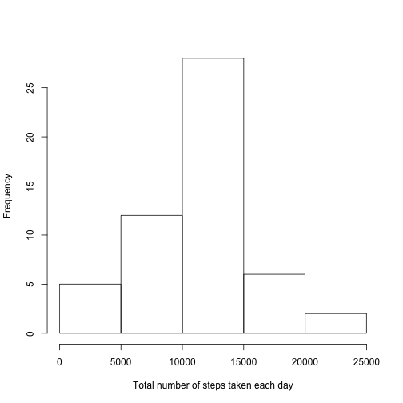
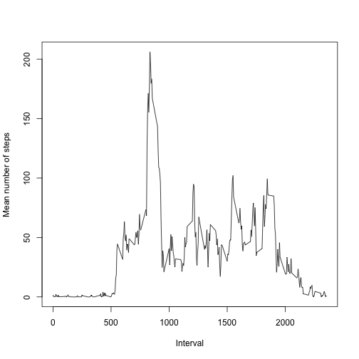
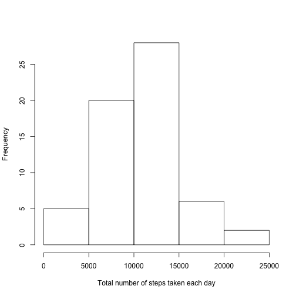
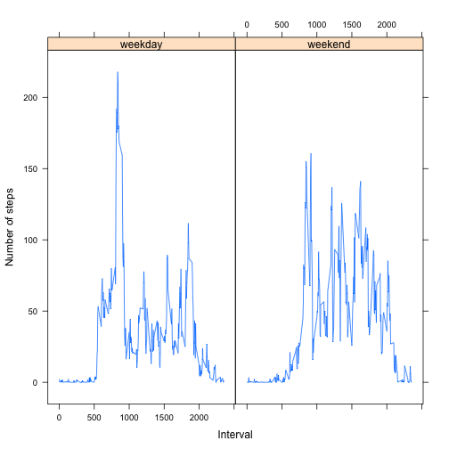

Reproducible Research: Peer Assessment 1
========================================

## Loading and preprocessing the data


```r
if ( ! file.exists("activity.csv") ) {
  unzip("activity.zip")
}

activity <- read.csv("activity.csv")
```

## What is mean total number of steps taken per day?


```r
totalStepsByDate <- aggregate(steps ~ date, data = activity, FUN = 'sum')
```

### Histogram of the total number of steps taken each day


```r
hist( totalStepsByDate$steps, main="", xlab="Total number of steps taken each day" )
```

 

### The mean and median total number of steps taken per day


```r
meanTotalSteps <- mean(totalStepsByDate$steps)
medianTotalSteps <- median(totalStepsByDate$steps)
```

The mean total number of steps taken per day is 10766 and the median is 10765.

## What is the average daily activity pattern?

### Time series plot by interval of the average number of steps, across all days


```r
meanStepsByInterval <- aggregate(steps ~ interval, data = activity, FUN = 'mean')

plot( meanStepsByInterval$steps ~ meanStepsByInterval$interval, type = "l", ylab="Mean number of steps", xlab="Interval" )
```

 

### The interval that contains the maximum average number of steps, across all days


```r
maxMeanStepsInterval <- meanStepsByInterval$interval[which.max(meanStepsByInterval$steps)]
```

The interval that contains the maximum mean number of steps, averaged across all days, is 835.

## Imputing missing values

### The total number of missing values in the dataset


```r
totalMissingValues <- sum(is.na(activity$steps))
```

The total number of missing values in the dataset is 2304.

### A strategy for filling in all of the missing values in the dataset

Missing values for number of steps will be filled in with the mean two numbers:

* the median number of steps for that interval, across all days, and

* the mean number of steps for that interval, across all days.


### A new dataset that is equal to the original dataset but with the missing data filled in

Using the previously calculated `meanStepsByInterval` data, we merge it with the original activity dataset so that each row now has the mean number of steps for its interval.


```r
working <- merge( meanStepsByInterval, activity, by = "interval", all = TRUE )

# Use a nice column name for the mean steps for the interval
colnames(working)[2] <- "meanStepsForInterval"

# Change the column name from "steps.y" so that we don't suffer from automatic column name changes during the next merge.
colnames(working)[3] <- "realSteps" 
```

Calculate the median number of steps for each interval, storing it in the `medianStepsByInterval` variable.

Using that data, we merge it with the newly modified dataset from above so that each row now has the median number of steps for its interval.


```r
medianStepsByInterval <- aggregate(steps ~ interval, data = activity, FUN = 'median')

working <- merge( medianStepsByInterval, working, by = "interval", all = TRUE )

# Use a nice column name for the median steps for the interval
colnames(working)[2] <- "medianStepsForInterval"
```

Now calculate the actual replacement value using the data from above.


```r
working$newValueToReplaceMissingValue <- rowMeans(working[,c('meanStepsForInterval','medianStepsForInterval')])
```

Create a `steps` column that has either the valid value supplied with the original data or the new replacement value if the original value is missing.


```r
working$steps <- ifelse( is.na( working$realSteps ), working$newValueToReplaceMissingValue, working$realSteps )
```

Now slim down the dataset so it contains only the columns we need.


```r
filledActivity <- subset( working, select=c( date, interval, steps ) )
  
rm( working ) # Clean up memory as much as possible.
```

### Histogram of the total number of steps taken each day, using the filled dataset


```r
totalStepsByDateFilled <- aggregate(steps ~ date, data = filledActivity, FUN = 'sum')

hist( totalStepsByDateFilled$steps, main="", xlab="Total number of steps taken each day" )
```

 

### The mean and median total number of steps taken per day, using the filled dataset


```r
meanTotalStepsFilled <- mean(totalStepsByDateFilled$steps)
medianTotalStepsFilled <- median(totalStepsByDateFilled$steps)
```

The mean total number of steps taken per day, according to the filled dataset, is 10135 and the median is 10395.

### Comparison between original data and filled data

Here are the mean and median calculated from the original dataset, the mean and median calculated from the filled dataset, and the differences between each.

|   |Original Data|Filled Data|Change (%)|
|---|---|---|---|
|Mean|10766|10135|-631.2 (-5.9%)|
|Median|10765|10395|-370 (-3.4%)|


As can be seen from the Change column, the mean and median both shift to smaller values. 

Therefore, it appears that this strategy filled missing values with new values that were lower than are genrally present in the original dataset.

A visual inspection of the two histograms supports this: The bar representing the next to smallest bucket of totals, 5000 to 10000, increases to nearly match the size of the largest bar, which represents the next largest buck of totals, 10000 to 15000. In other words, the visual center of the histogram moves to the left, to a smaller value.

## Are there differences in activity patterns between weekdays and weekends?

### Create a new factor variable in the dataset indicating whether the observation was measured on a weekday or weekend day


```r
# Get the day names for each date
activityDays <- weekdays(as.Date(filledActivity$date))

# Add the dayType column and set it to "weekend" or "weekday" based on the day names calculated above
filledActivity$dayType <- factor( ifelse(activityDays %in% c( "Saturday", "Sunday" ), "weekend", "weekday" ) )

rm( activityDays ) # Clean up unused memory
```

### Panel plot containing two time series plots by interval of the average number of steps, one across all weekday days and the other across all weekend days


```r
meanStepsByIntervalForDayType <- aggregate(steps ~ interval + dayType, data = filledActivity, FUN = 'mean')

library(lattice)
xyplot(steps ~ interval | dayType, data=meanStepsByIntervalForDayType, type = "l", ylab = "Number of steps", xlab = "Interval" )
```

 
